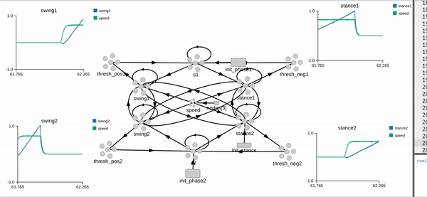

# CPG model using SNN

**Central pattern generators** (**CPGs**) are [biological neural circuits](https://en.wikipedia.org/wiki/Neural_circuit "Neural circuit") that produce rhythmic outputs in the absence of rhythmic input.[[1]](https://en.wikipedia.org/wiki/Central_pattern_generator#cite_note-Hooper-1)[[2]](https://en.wikipedia.org/wiki/Central_pattern_generator#cite_note-Kuo-2)[[3]](https://en.wikipedia.org/wiki/Central_pattern_generator#cite_note-Guertin-3) They are the source of the tightly-coupled patterns of neural activity that drive rhythmic and stereotyped motor behaviors like walking, swimming, breathing, or chewing.

This work implements CPG for two limbs controlling flexor and extensor mussels. It consists of two half-center oscillators.
We aimed to create the framework for comparing a versatile CPG rate model and its implementation with the model build with SNN. We used a neuromorphic software package (Nengo) to develop and validate a bilateral CPG model’s structural and functional details based on the halfcenter oscillators. The spiking model shows similar precision for calculating the empirical phase-duration characteristics of gait in cats as the rate model, and it also reproduces the linear relationship between the CPG input and the empirical limb speed of forward progression (Yakovenko, 2011)

## Installation

 1. Create environment python environment

        conda create -n cpg_nengo
 2. Install dependencies 
 
        pip install -r requirements.txt

## Running

#### CPG model

The nengo model defined in cpg.py file. It is possible to visualize model dynamics using Nengo GUI until. For this just run 

    nengo_gui
   and open cpg_vis.py file 

#### Optimization
Error functions defined in optimize.py
Command to run optimization using hyperout 
 
        python optimize_hyperopt.py

#### Help
Explanation of core CPG elements could be found in example folder.
Open each one with nengo_gui and go thought explanation

## Additional details
It is possible to run simulation on GPU using OpenCL-based simulator, which is a bit faster.
See https://github.com/nengo-labs/nengo-ocl
For this, you just need to replace 

    nengo.Simulator -> nengo_ocl.Simulator